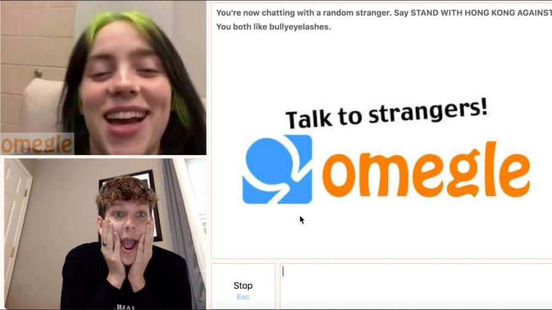
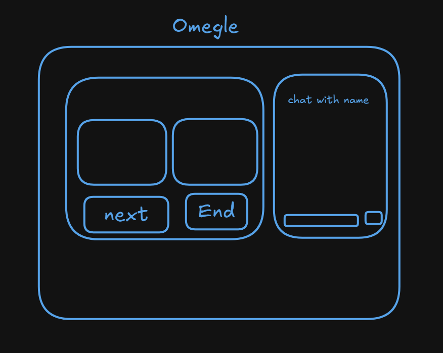

# Omegle (P2P) Connection
I made this for the practise and understanding the core architecture of omegle random video chat and the webRTC architecture

# Technologies 
## Frontend
- React js
- Vite for creating the react app
- React context Api for state management
- React router dom for the navigation
- Tailwind css for styling
- Socket.io-client package for the socket connection
- React-toastify for notificatons

## Backend
- Node js
- Socket.io library for creating the socket server
- Cors for cross section policy bypass
- Express js for routing

## Prototype

